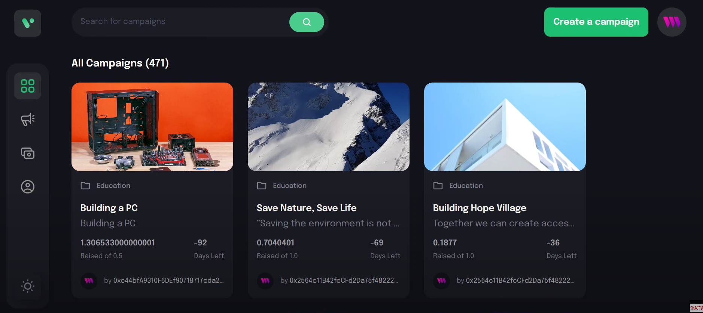
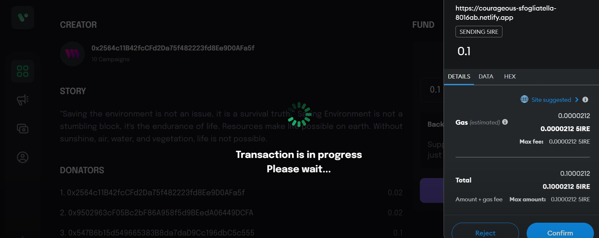
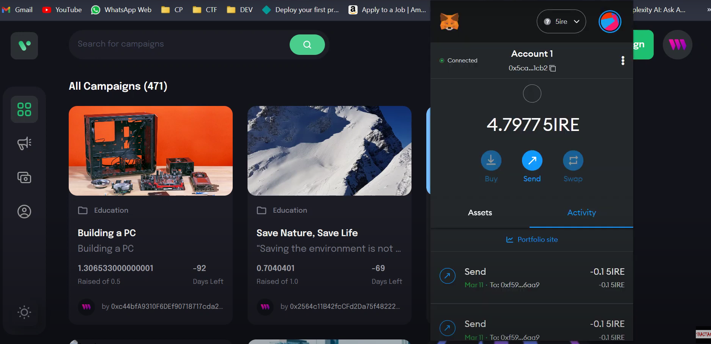
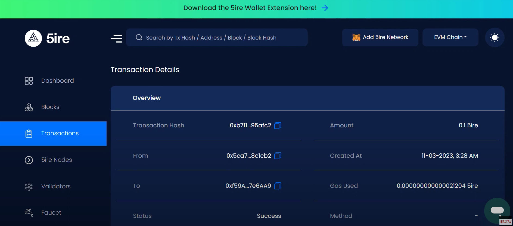
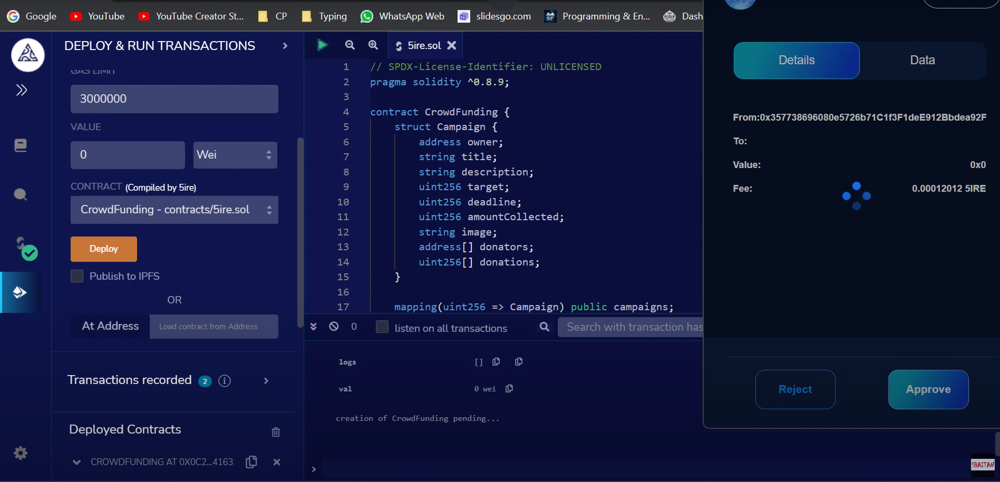

<h1>Team Name - Anonymous</h1>

<h2>Problem Statement - 5ire</h2>

<h2>Theme - Community Crowd Funding </h2>

<H3>Team Members</H3>
<ul>
<li>Ayush</li>
<li>Likhith</li>
<li>Shivank</li>
<li>Vaibhav</li>
<h1>Project Overview</h1>
<h4>Dashboard</h4>

<h4>Funding an Event</h4>

<h4>Fire Transaction Details</h4>

<h4>Tracking Transaction </h4>

<h4>Deployment Process</h4>

<h4>Creating Event</h4>

<h1> Prerequisite Before Running this project offline </h1>
Inside web3 folder run the following commands
npm install hardhat
npm run deploy

Inside client folder run the following commands
npx thirdweb create --app
npm install react-router-dom
npm run dev

Note :- You must have a 5ire wallet account and metamask extension installed in your browser with account created on it. It is adviced to add some free tokens in order to make transaction and test the application.

<h2> Demo Video Link </h2>
https://www.youtube.com/watch?v=dupdaYG7Hw0
